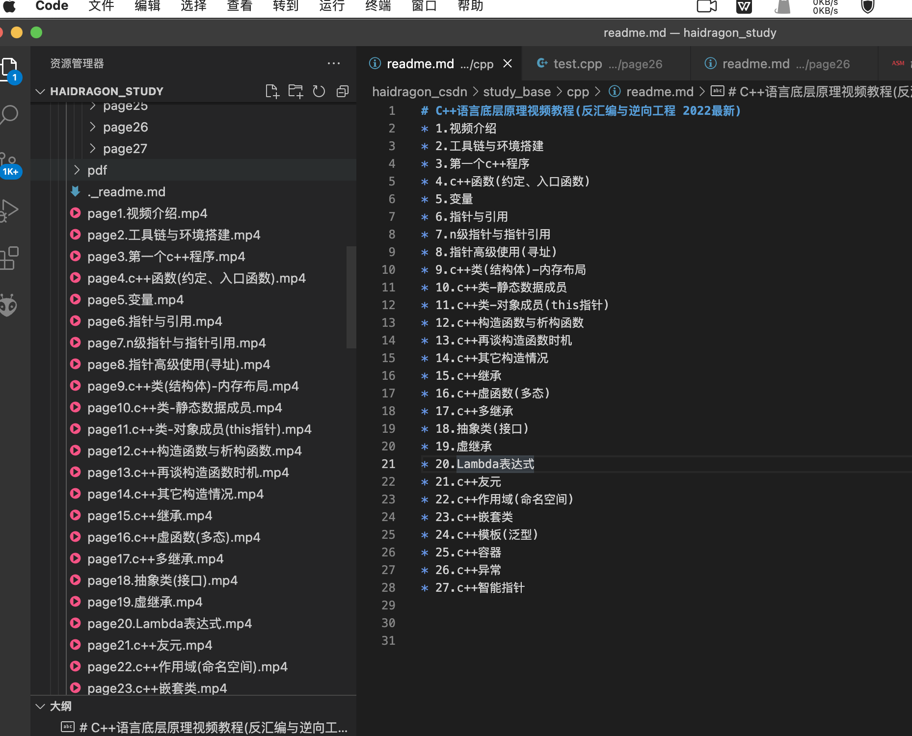
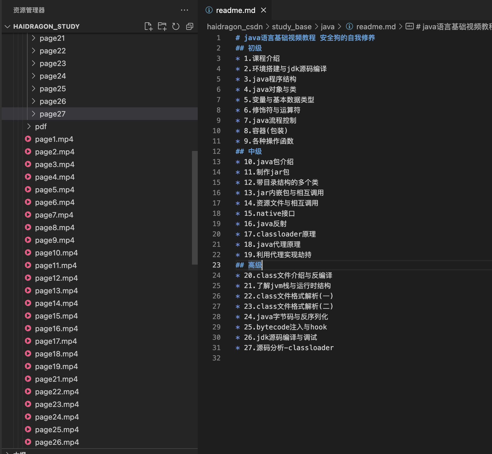

# php基础视频教程
* page1 环境搭建
* page2 变量、数据类型、类型比较
* page3 常量字符串、数组、运算符、条件语句
* page4 函数、时间、日期
* page5 异常处理、命名空间
* page6 面像对象(类)
* paga7 搭建web服务器环境
* page8 http协议基础、GET、POST请求
* page9 表单、文件上传、文件处理
* page10 XML、json
* page11 Cookie、Session
* page12 php动态调试

# arm32&64汇编语言基础视频教程
* 1.视频介绍
* 2.工具链与环境搭建
* 3.arm概念基础
* 4.arm寄存器介绍
* 5.程序结构与调试环境搭建
* 6.数据处理、传递、寻址、对齐
* 7.基本数学运算功能
* 8.控制执行流程
* 9.处理字符串
* 10.子例程
* 11.函数传参(调试约定)
* 12.多函数文件
* 13.与c语言函数相互调用
* 14.c语言内联汇编
* 15.arm64与arm32对比、arm64与c互调
* 16.arm系统调用介绍与实现
* 17.聚合数据类型

# mips32&64汇编语言基础视频教程
* 1.视频介绍
* 2.工具链与环境搭建
* 3.mips概念基础
* 4.mips寄存器介绍
* 5.程序结构与调试环境搭建
* 6.数据处理、传递、寻址、对齐
* 7.基本数学运算功能
* 8.控制执行流程
* 9.处理字符串
* 10.子例程
* 11.函数传参(调试约定)
* 12.多函数文件
* 13.与c语言函数相互调用
* 14.c语言内联汇编
* 15.mips64与mips32对比、mips64与c互调
* 16.mips系统调用介绍与实现
* 17.聚合数据类型

# x86_32&64汇编语言基础视频教程
* 1.视频介绍
* 2.工具链与环境搭建
* 3.x86概念基础
* 4.x86寄存器介绍
* 5.第一个汇编程序(intel汇编与AT&T汇编)
* 6.程序结构与调试环境搭建
* 7.数据处理、传递、寻址、对齐
* 8.基本数学运算功能
* 9.控制执行流程
* 10.处理字符串
* 11.子例程
* 12.函数传参(调试约定)
* 13.多函数文件
* 14.与c语言函数相互调用
* 15.c语言内联汇编
* 16.x86_32与64位对比、x86_64与c互调
* 17.x86系统调用介绍与实现
* 18.聚合数据类型
* 19.clang编译器
* 20.msvc编译器

# C++语言底层原理视频教程(反汇编与逆向工程 2022最新)
* 1.视频介绍
* 2.工具链与环境搭建
* 3.第一个c++程序
* 4.c++函数(约定、入口函数)
* 5.变量
* 6.指针与引用
* 7.n级指针与指针引用
* 8.指针高级使用(寻址)
* 9.c++类(结构体)-内存布局
* 10.c++类-静态数据成员
* 11.c++类-对象成员(this指针)
* 12.c++构造函数与析构函数
* 13.c++再谈构造函数时机
* 14.c++其它构造情况
* 15.c++继承
* 16.c++虚函数(多态)
* 17.c++多继承
* 18.抽象类(接口)
* 19.虚继承
* 20.Lambda表达式
* 21.c++友元
* 22.c++作用域(命名空间)
* 23.c++嵌套类
* 24.c++模板(泛型)
* 25.c++容器
* 26.c++异常
* 27.c++智能指针

# java语言基础视频教程 安全狗的自我修养
## 初级
* 1.课程介绍
* 2.环境搭建与jdk源码编译
* 3.java程序结构
* 4.java对象与类
* 5.变量与基本数据类型
* 6.修饰符与运算符
* 7.java流程控制
* 8.容器(包装)
* 9.各种操作函数
## 中级
* 10.java包介绍
* 11.制作jar包
* 12.带目录结构的多个类 
* 13.jar内嵌包与相互调用
* 14.资源文件与相互调用 
* 15.native接口
* 16.java反射
* 17.classloader原理
* 18.java代理原理
* 19.利用代理实现劫持
## 高级
* 20.class文件介绍与反编译  
* 21.了解jvm栈与运行时结构
* 22.class文件格式解析(一)
* 23.class文件格式解析(二)
* 24.java字节码与反序列化
* 25.bytecode注入与hook
* 26.jdk源码编译与调试
* 27.源码分析-classloader

