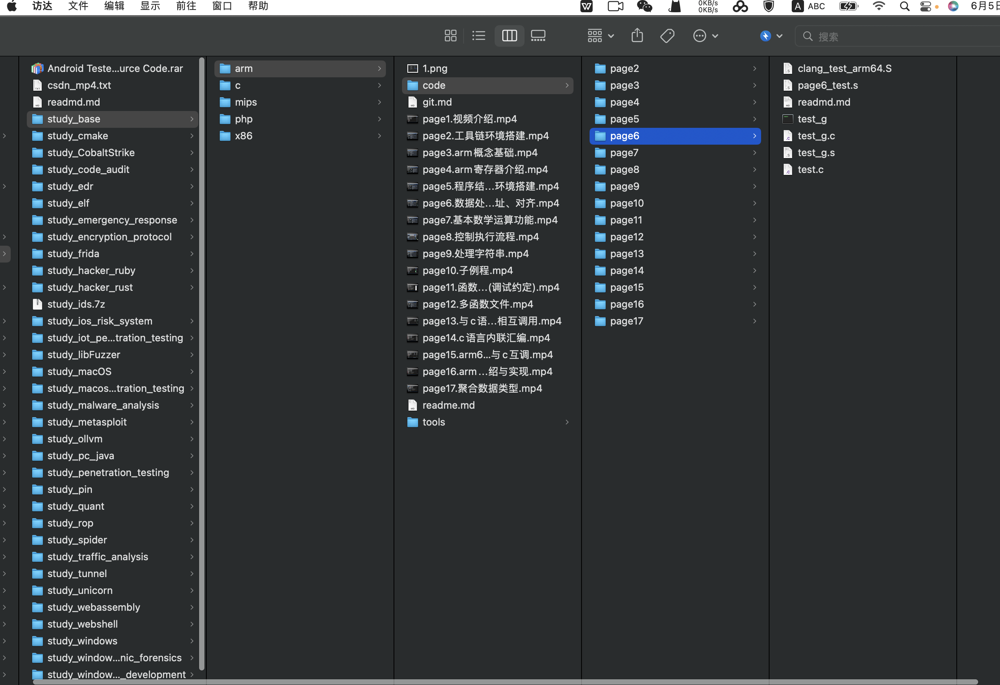

# php基础视频教程
* page1 环境搭建
* page2 变量、数据类型、类型比较
* page3 常量字符串、数组、运算符、条件语句
* page4 函数、时间、日期
* page5 异常处理、命名空间
* page6 面像对象(类)
* paga7 搭建web服务器环境
* page8 http协议基础、GET、POST请求
* page9 表单、文件上传、文件处理
* page10 XML、json
* page11 Cookie、Session
* page12 php动态调试

# arm32&64汇编语言基础视频教程
* 1.视频介绍
* 2.工具链与环境搭建
* 3.arm概念基础
* 4.arm寄存器介绍
* 5.程序结构与调试环境搭建
* 6.数据处理、传递、寻址、对齐
* 7.基本数学运算功能
* 8.控制执行流程
* 9.处理字符串
* 10.子例程
* 11.函数传参(调试约定)
* 12.多函数文件
* 13.与c语言函数相互调用
* 14.c语言内联汇编
* 15.arm64与arm32对比、arm64与c互调
* 16.arm系统调用介绍与实现
* 17.聚合数据类型

# mips32&64汇编语言基础视频教程
* 1.视频介绍
* 2.工具链与环境搭建
* 3.mips概念基础
* 4.mips寄存器介绍
* 5.程序结构与调试环境搭建
* 6.数据处理、传递、寻址、对齐
* 7.基本数学运算功能
* 8.控制执行流程
* 9.处理字符串
* 10.子例程
* 11.函数传参(调试约定)
* 12.多函数文件
* 13.与c语言函数相互调用
* 14.c语言内联汇编
* 15.mips64与mips32对比、mips64与c互调
* 16.mips系统调用介绍与实现
* 17.聚合数据类型

# x86_32&64汇编语言基础视频教程
* 1.视频介绍
* 2.工具链与环境搭建
* 3.x86概念基础
* 4.x86寄存器介绍
* 5.第一个汇编程序(intel汇编与AT&T汇编)
* 6.程序结构与调试环境搭建
* 7.数据处理、传递、寻址、对齐
* 8.基本数学运算功能
* 9.控制执行流程
* 10.处理字符串
* 11.子例程
* 12.函数传参(调试约定)
* 13.多函数文件
* 14.与c语言函数相互调用
* 15.c语言内联汇编
* 16.x86_32与64位对比、x86_64与c互调
* 17.x86系统调用介绍与实现
* 18.聚合数据类型
* 19.clang编译器
* 20.msvc编译器

