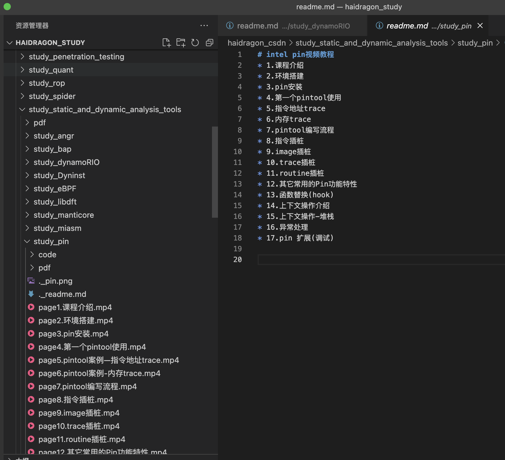
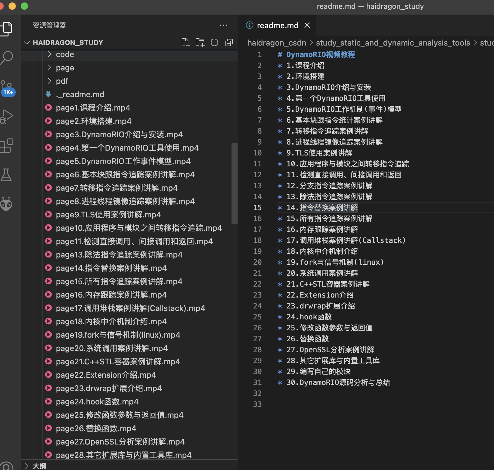
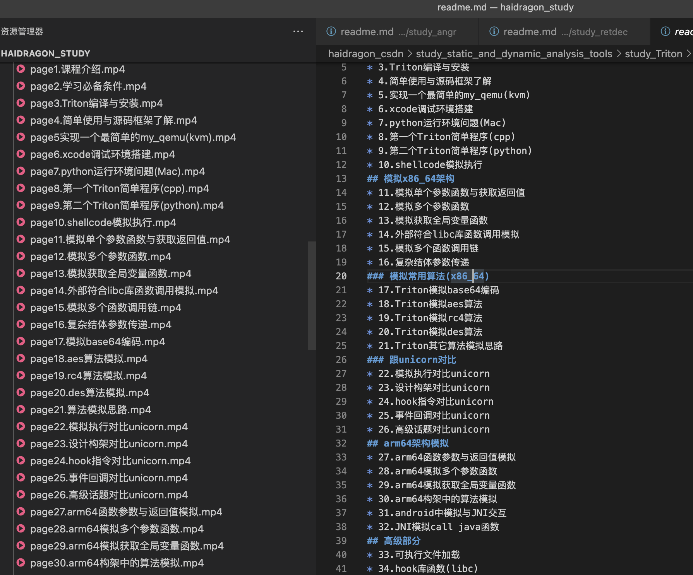
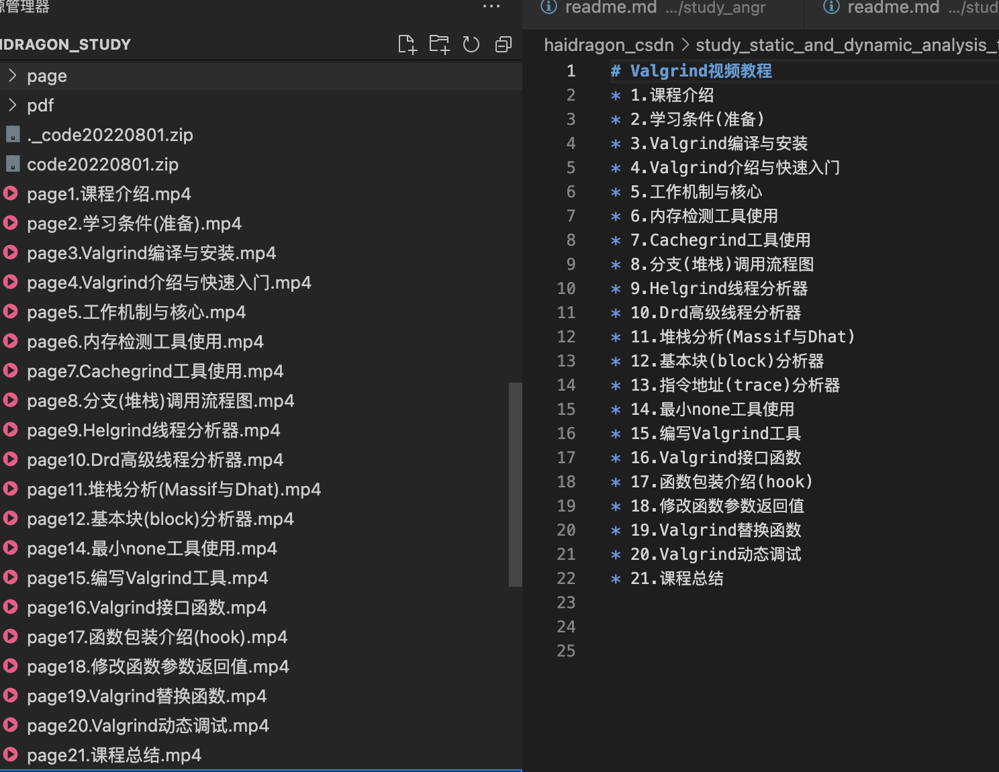
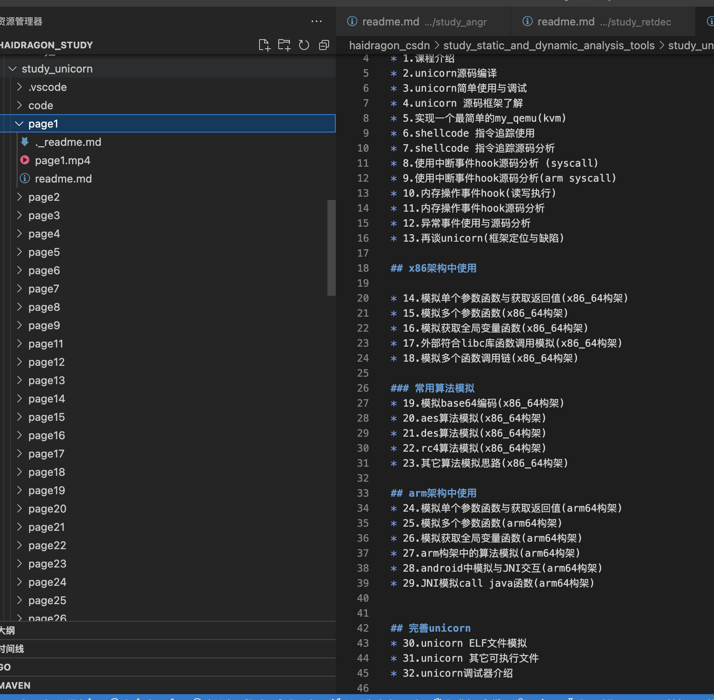

# 
# intel pin视频教程
* 1.课程介绍
* 2.环境搭建
* 3.pin安装
* 4.第一个pintool使用
* 5.指令地址trace
* 6.内存trace
* 7.pintool编写流程
* 8.指令插桩
* 9.image插桩
* 10.trace插桩
* 11.routine插桩
* 12.其它常用的Pin功能特性
* 13.函数替换(hook)
* 14.上下文操作介绍
* 15.上下文操作-堆栈
* 16.异常处理
* 17.pin 扩展(调试)
# 
# DynamoRIO视频教程
* 1.课程介绍
* 2.环境搭建
* 3.DynamoRIO介绍与安装
* 4.第一个DynamoRIO工具使用
* 5.DynamoRIO工作机制(事件)模型
* 6.基本块跟指令统计案例讲解
* 7.转移指令追踪案例讲解
* 8.进程线程镜像追踪案例讲解
* 9.TLS使用案例讲解
* 10.应用程序与模块之间转移指令追踪
* 11.检测直接调用、间接调用和返回
* 12.分支指令追踪案例讲解
* 13.除法指令追踪案例讲解
* 14.指令替换案例讲解
* 15.所有指令追踪案例讲解
* 16.内存跟踪案例讲解
* 17.调用堆栈案例讲解(Callstack)
* 18.内核中介机制介绍
* 19.fork与信号机制(linux)
* 20.系统调用案例讲解
* 21.C++STL容器案例讲解
* 22.Extension介绍
* 23.drwrap扩展介绍
* 24.hook函数
* 25.修改函数参数与返回值
* 26.替换函数
* 27.OpenSSL分析案例讲解
* 28.其它扩展库与内置工具库
* 29.编写自己的模块
* 30.DynamoRIO源码分析与总结

# 

## Triton介绍与环境搭建
* 1.课程介绍
* 2.学习必备条件
* 3.Triton编译与安装
* 4.简单使用与源码框架了解
* 5.实现一个最简单的my_qemu(kvm)
* 6.xcode调试环境搭建
* 7.python运行环境问题(Mac)
* 8.第一个Triton简单程序(cpp)
* 9.第二个Triton简单程序(python)
* 10.shellcode模拟执行
## 模拟x86_64架构
* 11.模拟单个参数函数与获取返回值
* 12.模拟多个参数函数
* 13.模拟获取全局变量函数
* 14.外部符合libc库函数调用模拟
* 15.模拟多个函数调用链
* 16.复杂结体参数传递
### 模拟常用算法(x86_64)
* 17.Triton模拟base64编码
* 18.Triton模拟aes算法
* 19.Triton模拟rc4算法
* 20.Triton模拟des算法
* 21.Triton其它算法模拟思路
### 跟unicorn对比
* 22.模拟执行对比unicorn
* 23.设计构架对比unicorn
* 24.hook指令对比unicorn
* 25.事件回调对比unicorn
* 26.高级话题对比unicorn
## arm64架构模拟
* 27.arm64函数参数与返回值模拟
* 28.arm64模拟多个参数函数
* 29.arm64模拟获取全局变量函数
* 30.arm64构架中的算法模拟
* 31.android中模拟与JNI交互
* 32.JNI模拟call java函数
## 高级部分  
* 33.可执行文件加载
* 34.hook库函数(libc) 
* 35.符号执行与污点分析
* 36.符号执行案例
* 37.污点分析案例
* 38.Triton反混淆
 
# eBPF视频教程
* 1.课程介绍
* 2.eBPF介绍
* 3.eBPF工作机制(组成)
* 4.eBPF使用快速入门
* 5.动态插桩技术介绍
* 6.kprobes原理
* 7.uprobes原理
* 8.静态插桩技术介绍
* 9.静态插桩跟踪点原理
* 10.USDT原理
* 11.动态USDT
* 12.调用栈回溯
* 13.BCC组件与特性
* 14.安装BCC
* 15.BCC的工具介绍
* 16.funcount案例讲解
* 17.stackcount案例讲解
* 18.tarce案例讲解
* 19.BCC工具开发
* 20.BCC内部实现原理
* 21.BCC的调试
* 22.bpftrace组件与特性
* 23.bpftrace安装
* 24.bpftrace的工具介绍
* 25.bpftrace与Dtrace对比
* 26.bpftrace探针类型
* 27.bpftrace控制流
* 28.bpftrace运算符
* 29.bpftrace变量
* 30.bpftrace函数
* 31.bpftrace映射表
* 32.cpu相关工具与使用
* 33.内存相关工具与使用
* 34.文件系统相关工具与使用
* 35.磁盘IO相关工具与使用
* 36.网络相关工具与使用
* 37.安全相关工具与使用
* 38.编程语言相关
* 39.修改函数参数与返回值
* 40.总结与eBPF相关资料

# 
* 1.课程介绍
* 2.环境搭建
* 3.Valgrind介绍与安装
* 4.Valgrind快速入门
* 5.Valgrind工作机制
* 7.Valgrind使用核心
* 8.Valgrind高级话题(tools)
* 9.Memcheck工具使用
* 10.Cachegrind工具使用
* 11.Callgrind工具使用
* 12.Helgrind工具使用
* 13.Drd工具使用
* 14.Dhat工具使用
* 15.Exp-bbv工具使用
* 16.lackey工具使用
* 17.Massif工具使用
* 18.最小none工具使用
* 19.自定义工具流程
* 20.Valgrind函数使用
* ...

# 
## 基础

* 1.课程介绍
* 2.unicorn源码编译
* 3.unicorn简单使用与调试
* 4.unicorn 源码框架了解
* 5.实现一个最简单的my_qemu(kvm)
* 6.shellcode 指令追踪使用
* 7.shellcode 指令追踪源码分析
* 8.使用中断事件hook源码分析 (syscall)
* 9.使用中断事件hook源码分析(arm syscall)
* 10.内存操作事件hook(读写执行)
* 11.内存操作事件hook源码分析
* 12.异常事件使用与源码分析
* 13.再谈unicorn(框架定位与缺陷)

## x86架构中使用

* 14.模拟单个参数函数与获取返回值(x86_64构架)
* 15.模拟多个参数函数(x86_64构架)
* 16.模拟获取全局变量函数(x86_64构架)
* 17.外部符合libc库函数调用模拟(x86_64构架)
* 18.模拟多个函数调用链(x86_64构架)

### 常用算法模拟
* 19.模拟base64编码(x86_64构架)
* 20.aes算法模拟(x86_64构架)
* 21.des算法模拟(x86_64构架)
* 22.rc4算法模拟(x86_64构架)
* 23.其它算法模拟思路(x86_64构架)

## arm架构中使用
* 24.模拟单个参数函数与获取返回值(arm64构架)
* 25.模拟多个参数函数(arm64构架)
* 26.模拟获取全局变量函数(arm64构架)
* 27.arm构架中的算法模拟(arm64构架)
* 28.android中模拟与JNI交互(arm64构架)
* 29.JNI模拟call java函数(arm64构架)

## 完善unicorn   
* 30.unicorn ELF文件模拟
* 31.unicorn 其它可执行文件
* 32.unicorn调试器介绍

## ollvm混淆
* 33.unicorn结合capstone使用
* 34.生成CFG(控制流程图)
* 35.ollvm反混淆思路 
